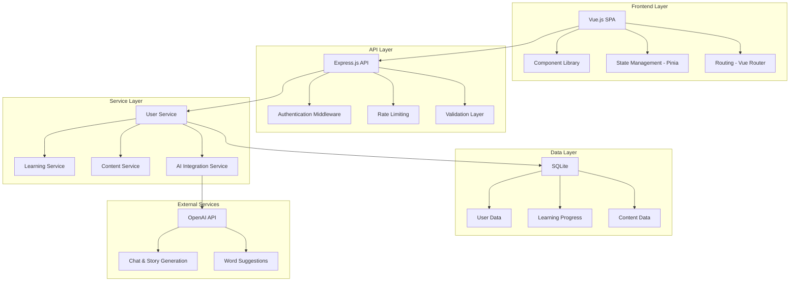
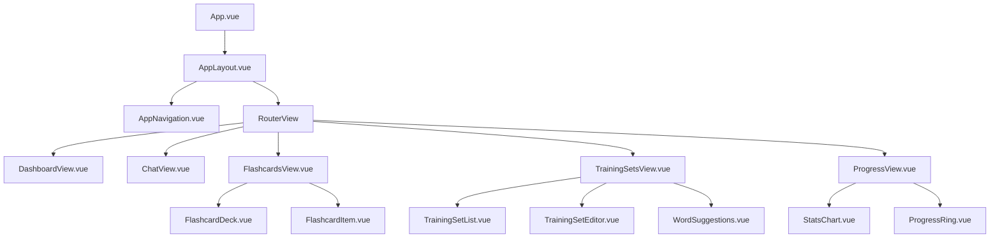

# Design Document

## Overview

LingoLab will be built as a modern, responsive web application using a component-based architecture. The system will feature a Vue.js-based frontend with TypeScript for type safety, a Node.js backend with Express, and an SQLite database for data persistence (with migration path to PostgreSQL for production scaling). LingoLab will integrate with AI services for chat functionality, word suggestions, and story generation.

LingoLab's architecture emphasizes modularity and extensibility, allowing for easy addition of new learning modules and features. The design incorporates modern UX patterns with a clean, intuitive interface that adapts seamlessly across devices.

## Architecture

### High-Level Architecture



### Technology Stack

**Frontend:**
- Vue.js 3 with Composition API and TypeScript
- Vite for build tooling and development server
- Tailwind CSS for styling with custom design system
- Pinia for state management
- TanStack Query (Vue Query) for server state management
- Vue Router for navigation
- Vue Transition API for animations

**Backend:**
- Node.js with Express.js
- TypeScript for type safety
- Prisma ORM for database operations
- JWT for authentication
- Zod for request validation
- Rate limiting with express-rate-limit

**Database:**
- SQLite for primary data storage (development and initial production)
- Migration path to PostgreSQL for scaling
- Redis for session management and caching (optional for initial version)

**External Services:**
- OpenAI API for AI chat, word suggestions, and story generation
- File upload service for import/export functionality

## Components and Interfaces

### Frontend Component Architecture



### Core Components

**1. Learning Module Interface**
```typescript
interface LearningModule {
  id: string;
  name: string;
  icon: string;
  component: React.ComponentType;
  isActive: boolean;
  progress?: number;
}
```

**2. Flashcard Component**
```typescript
// Vue component props interface
interface FlashcardProps {
  word: Word;
  showAnswer: boolean;
}

// Vue component emits interface
interface FlashcardEmits {
  answer: [correct: boolean];
  flip: [];
}
```

**3. Training Set Manager**
```typescript
// Vue component props interface
interface TrainingSetManagerProps {
  sets: TrainingSet[];
}

// Vue component emits interface
interface TrainingSetManagerEmits {
  createSet: [set: Partial<TrainingSet>];
  editSet: [id: string, updates: Partial<TrainingSet>];
  deleteSet: [id: string];
}
```

### Backend API Design

**Authentication Endpoints:**
- `POST /api/auth/register` - User registration
- `POST /api/auth/login` - User login
- `POST /api/auth/refresh` - Token refresh
- `POST /api/auth/logout` - User logout

**User Management:**
- `GET /api/user/profile` - Get user profile
- `PUT /api/user/profile` - Update user profile
- `PUT /api/user/language` - Set target language

**Training Sets:**
- `GET /api/training-sets` - Get user's training sets
- `POST /api/training-sets` - Create new training set
- `PUT /api/training-sets/:id` - Update training set
- `DELETE /api/training-sets/:id` - Delete training set
- `POST /api/training-sets/import` - Import from file
- `GET /api/training-sets/:id/export` - Export to file

**Learning Progress:**
- `GET /api/progress/dashboard` - Get dashboard statistics
- `POST /api/progress/word-review` - Record word review result
- `GET /api/progress/due-words` - Get words due for review

**AI Integration:**
- `POST /api/ai/chat` - Send chat message
- `POST /api/ai/word-suggestions` - Get word suggestions
- `POST /api/ai/generate-story` - Generate story from words
- `POST /api/ai/generate-exam` - Generate exam questions

## Data Models

### User Model
```typescript
interface User {
  id: string;
  email: string;
  username: string;
  targetLanguage: string;
  nativeLanguage: string;
  createdAt: Date;
  updatedAt: Date;
  preferences: UserPreferences;
}

interface UserPreferences {
  dailyGoal: number;
  notificationsEnabled: boolean;
  difficultyLevel: 'beginner' | 'intermediate' | 'advanced';
  preferredStudyTime: string;
}
```

### Word Model
```typescript
interface Word {
  id: string;
  text: string;
  translation: string;
  pronunciation?: string;
  partOfSpeech: string;
  difficulty: number;
  language: string;
  createdAt: Date;
  examples: Example[];
}

interface Example {
  id: string;
  sentence: string;
  translation: string;
}
```

### Training Set Model
```typescript
interface TrainingSet {
  id: string;
  name: string;
  description?: string;
  userId: string;
  words: Word[];
  category: string;
  isPublic: boolean;
  createdAt: Date;
  updatedAt: Date;
  metadata: {
    totalWords: number;
    averageDifficulty: number;
    estimatedStudyTime: number;
  };
}
```

### Learning Progress Model
```typescript
interface WordProgress {
  id: string;
  userId: string;
  wordId: string;
  currentInterval: number;
  easeFactor: number;
  repetitions: number;
  nextReviewDate: Date;
  lastReviewDate: Date;
  correctStreak: number;
  totalReviews: number;
  averageResponseTime: number;
}
```

### Spaced Repetition Algorithm
The system will implement a modified SM-2 algorithm:

```typescript
interface SpacedRepetitionResult {
  nextInterval: number;
  easeFactor: number;
  repetitions: number;
  nextReviewDate: Date;
}

function calculateNextReview(
  quality: number, // 0-5 scale
  currentInterval: number,
  easeFactor: number,
  repetitions: number
): SpacedRepetitionResult;
```

## Error Handling

### Frontend Error Handling
- Global error boundary for React component errors
- API error interceptors with user-friendly messages
- Offline detection and graceful degradation
- Form validation with real-time feedback

### Backend Error Handling
- Centralized error handling middleware
- Structured error responses with error codes
- Request validation with detailed error messages
- Rate limiting with appropriate HTTP status codes

### Error Response Format
```typescript
interface ErrorResponse {
  success: false;
  error: {
    code: string;
    message: string;
    details?: any;
    timestamp: string;
  };
}
```

## Testing Strategy

### Frontend Testing
- **Unit Tests:** Vitest and Vue Testing Library for component testing
- **Integration Tests:** Testing user workflows and component interactions
- **E2E Tests:** Playwright for critical user journeys
- **Visual Regression Tests:** Storybook with Chromatic for UI consistency

### Backend Testing
- **Unit Tests:** Jest for service and utility function testing
- **Integration Tests:** Supertest for API endpoint testing
- **Database Tests:** Test database with migrations and seed data
- **Load Tests:** Artillery for performance testing

### Test Coverage Goals
- Minimum 80% code coverage for critical paths
- 100% coverage for spaced repetition algorithm
- All API endpoints must have integration tests
- Critical user flows must have E2E tests

### Testing Environments
- **Development:** Local testing with test database
- **Staging:** Full environment testing with production-like data
- **CI/CD:** Automated testing on every pull request

## Performance Considerations

### Frontend Optimization
- Code splitting by route and feature
- Lazy loading of learning modules
- Image optimization and lazy loading
- Service worker for offline functionality
- Virtual scrolling for large word lists

### Backend Optimization
- Database indexing for frequently queried fields
- Caching with Redis for user sessions and frequently accessed data
- API response compression
- Rate limiting to prevent abuse
- Connection pooling for database connections

### Database Design
- **SQLite Phase:** Proper indexing on foreign keys and frequently queried columns
- **Migration Strategy:** Database abstraction layer to support easy migration to PostgreSQL
- **Scaling Considerations:** When user base grows, migrate to PostgreSQL with partitioning for large tables
- Regular maintenance and optimization procedures

## Security Considerations

### Authentication & Authorization
- JWT tokens with short expiration times
- Refresh token rotation
- Role-based access control
- Password hashing with bcrypt

### Data Protection
- Input validation and sanitization
- SQL injection prevention through parameterized queries
- XSS protection with Content Security Policy
- HTTPS enforcement
- Secure cookie settings

### API Security
- Rate limiting per user and IP
- Request size limits
- CORS configuration
- API versioning for backward compatibility

## Deployment Architecture

### Infrastructure
- **Frontend:** Deployed to Vercel or Netlify with CDN
- **Backend:** Deployed to Railway or Render with auto-scaling
- **Database:** 
  - **Initial:** SQLite file-based database (suitable for single-instance deployment)
  - **Scaling:** Migrate to managed PostgreSQL service (Supabase or Railway)
- **Redis:** Optional managed Redis service for caching (add when scaling)

### CI/CD Pipeline
- GitHub Actions for automated testing and deployment
- Separate staging and production environments
- Database migrations as part of deployment process
- Health checks and rollback procedures

### Monitoring
- Application performance monitoring
- Error tracking and alerting
- Database performance monitoring
- User analytics and usage tracking